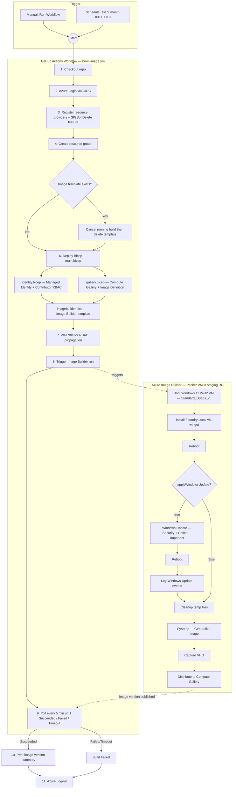

# Build Flow

This diagram shows the end-to-end logic flow when the **Build Windows 11 + Foundry Local Image** workflow is triggered.

## Files involved

| Step | File | Purpose |
|------|------|---------|
| Workflow orchestration | `.github/workflows/build-image.yml` | GitHub Actions workflow — triggers, inputs, Azure CLI steps |
| Root Bicep template | `infra/main.bicep` | Orchestrates all Bicep modules |
| Parameters | `infra/main.bicepparam` | Default values for the deployment |
| Managed Identity | `infra/modules/identity.bicep` | Creates the user-assigned identity + Contributor RBAC |
| Compute Gallery | `infra/modules/gallery.bicep` | Creates the gallery with community sharing + image definition |
| Image Builder | `infra/modules/imagebuilder.bicep` | Defines the Packer-based build template with customization steps |
| Bicep config | `infra/bicepconfig.json` | Registers the Microsoft Graph extension |
